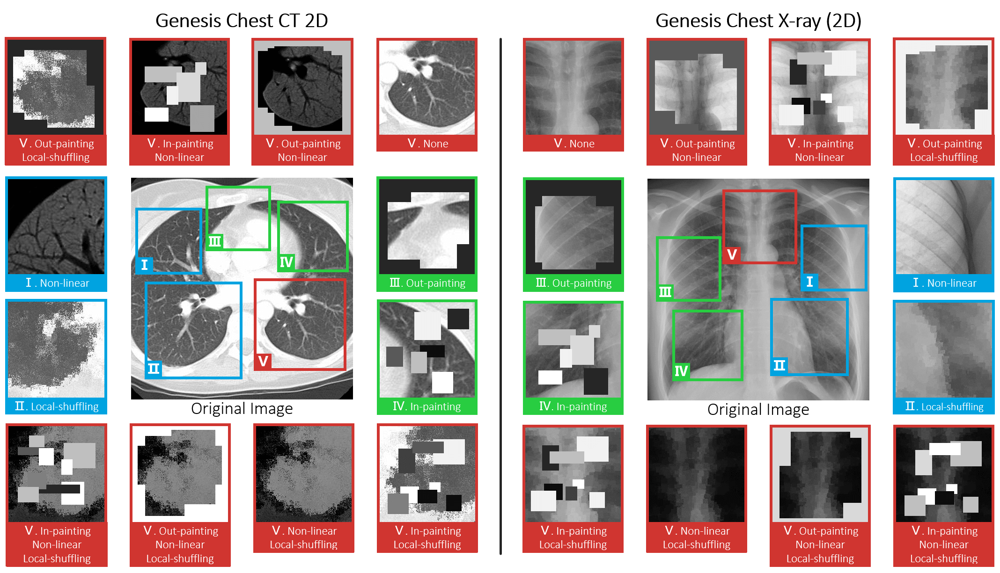
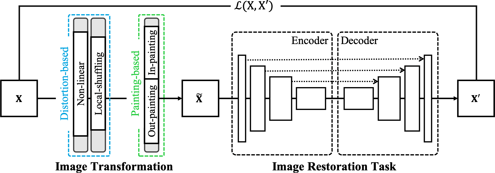
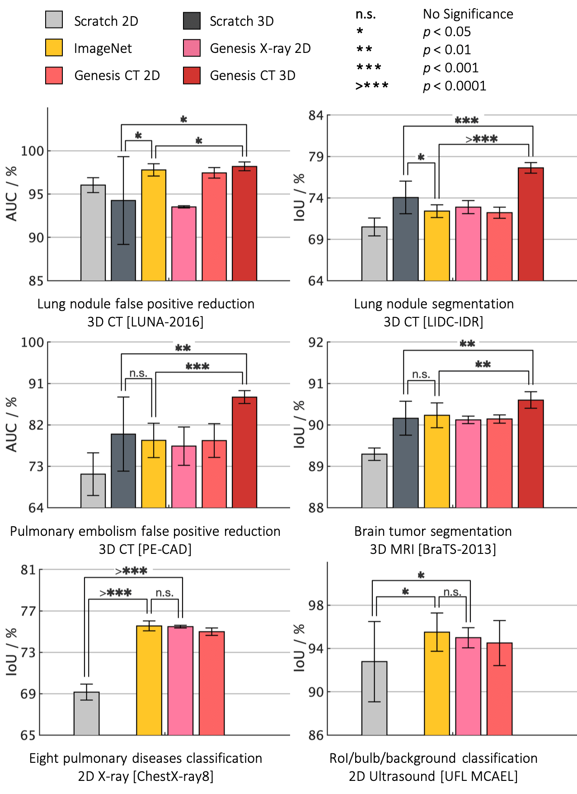

<p align="center"></p>

--------------------------------------------------------------------------------

We have built a set of pre-trained models called <b>Generic Autodidactic Models</b>, nicknamed <b>Models Genesis</b>, because they are created <i>ex nihilo</i> (with no manual labeling), self-taught (learned by self-supervision), and generic (served as source models for generating application-specific target models). We envision that Models Genesis may serve as a primary source of transfer learning for 3D medical imaging applications, in particular, with limited annotated data. 

<p align="center"></p>
<p align="center"></p>

<br/>

# Paper
This repository provides the official Keras implementation of training Models Genesis as well as the usage of the pre-trained Models Genesis in the following paper:

<b>Models Genesis: Generic Autodidactic Models for 3D Medical Image Analysis</b> <br/>
[Zongwei Zhou](https://www.zongweiz.com/)<sup>1</sup>, [Vatsal Sodha](https://github.com/vatsal-sodha)<sup>1</sup>, [Md Mahfuzur Rahman Siddiquee](https://github.com/mahfuzmohammad)<sup>1</sup>,  <br/>
[Ruibin Feng](https://chs.asu.edu/ruibin-feng)<sup>1</sup>, [Nima Tajbakhsh](https://www.linkedin.com/in/nima-tajbakhsh-b5454376/)<sup>1</sup>, [Michael B. Gotway](https://www.mayoclinic.org/biographies/gotway-michael-b-m-d/bio-20055566)<sup>2</sup> and [Jianming Liang](https://chs.asu.edu/jianming-liang)<sup>1</sup> <br/>
<sup>1 </sup>Arizona State University,   <sup>2 </sup>Mayo Clinic <br/>
International Conference on Medical Image Computing and Computer Assisted Intervention (MICCAI), 2019 <br/>
<b>[Young Scientist Award](http://www.miccai.org/about-miccai/awards/young-scientist-award/)</b>  <br/>
[paper](http://www.cs.toronto.edu/~liang/Publications/ModelsGenesis/MICCAI_2019_Full.pdf) | [code](https://github.com/MrGiovanni/ModelsGenesis) | [slides](https://docs.wixstatic.com/ugd/deaea1_c5e0f8cd9cde4c3db339d866483cbcd3.pdf) | [poster](http://www.cs.toronto.edu/~liang/Publications/ModelsGenesis/Models_Genesis_Poster.pdf) | talk ([YouTube](https://youtu.be/5W_uGzBloZs), [YouKu](https://v.youku.com/v_show/id_XNDM5NjQ1ODAxMg==.html?sharefrom=iphone&sharekey=496e1494c76ed263653aa3aada61c23e6))

<br/>

# Dependencies

+ Linux
+ Python 2.7
+ Keras 2.1.3
+ TensorFlow 1.4.0

# Usage of the pre-trained Models Genesis

### 1. Clone the repository
```bash
$ git clone https://github.com/MrGiovanni/ModelsGenesis.git
$ cd ModelsGenesis/
$ pip install -r requirements.txt
```

### 2. Download the pre-trained Models Genesis
To download the pre-trained Models Genesis, first request [here](https://www.wjx.top/jq/46747127.aspx). 
After submitting the form, download the pre-trained Genesis Chest CT and save into `./pretrained_weights/Genesis_Chest_CT.h5` directory.


### 3. Fine-tune Models Genesis on your own target task
Models Genesis learn a general-purpose image representation that can be leveraged for a wide range of target tasks. Specifically, Models Genesis can be utilized to initialize the encoder for the target <i>classification</i> tasks and to initialize the encoder-decoder for the target <i>segmentation</i> tasks.

As for the target classification tasks, the 3D deep model can be initialized with the pre-trained encoder using the following example:
```python
# prepare your own data
X, y = your_data_loader()

# prepare the 3D model
import keras
from unet3d import *
input_channels, input_rows, input_cols, input_deps = 1, 64, 64, 32
num_class, activate = 2, 'softmax'
weight_dir = 'pretrained_weights/Genesis_Chest_CT.h5'
models_genesis = unet_model_3d((input_channels, input_rows, input_cols, input_deps), batch_normalization=True)
print("Load pre-trained Models Genesis weights from {}".format(weight_dir))
models_genesis.load_weights(weight_dir)
x = models_genesis.get_layer('depth_7_relu').output
x = GlobalAveragePooling3D()(x)
x = Dense(1024, activation='relu')(x)
output = Dense(num_class, activation=activate)(x)
model = keras.models.Model(inputs=models_genesis.input, outputs=output)
model.compile(optimizer="adam", loss=dice_coef_loss, metrics=[mean_iou,dice_coef])

# train the model
model.fit(X, y)
```

As for the target segmentation tasks, the 3D deep model can be initialized with the pre-trained encoder-decoder using the following example:
```python
# prepare your own data
X, Y = your_data_loader()

# prepare the 3D model
from unet3d import *
input_channels, input_rows, input_cols, input_deps = 1, 64, 64, 32
num_class, activate = 2, keras.activations.softmax
weight_dir = 'pretrained_weights/Genesis_Chest_CT.h5'
models_genesis = unet_model_3d((input_channels, input_rows, input_cols, input_deps), batch_normalization=True)
print("Load pre-trained Models Genesis weights from {}".format(weight_dir))
models_genesis.load_weights(weight_dir)
x = models_genesis.get_layer('depth_13_relu').output
final_convolution = Conv3D(num_class, (1, 1, 1))(x)
output = activate(final_convolution, axis=1)
model = keras.models.Model(inputs=models_genesis.input, outputs=output)
models.compile(optimizer="adam", loss=dice_coef_loss, metrics=[mean_iou,dice_coef])

# train the model
model.fit(X, Y)
```

**Prepare your own data:** If the image modality in your target task is CT, we suggest that all the intensity values be clipped on the min (-1000) and max (+1000) interesting Hounsfield Unit range and then scale between 0 and 1. If the image modality is MRI, we suggest that all the intensity values be clipped on min (0) and max (+4000) interesting range and then scale between 0 and 1. For any other modalities, you may want to first clip on the meaningful intensity range and then scale between 0 and 1. We adopt input cubes shaped in (N, 1, 64, 64, 32) during model pre-training, where N denotes the number of training samples, although any size is acceptable as long as it is divisible by 16 (=2^4) due to four down-sampling layers in V-Net.

### 4. Major results from our work

- Models Genesis outperform 3D models trained from scratch 
- Models Genesis top any 2D approaches, including ImageNet models and degraded 2D Models Genesis
- Models Genesis (2D) offer performances equivalent to supervised pretrained models

<p align="center"></p>

Note that learning from scratch <i>simply</i> in 3D may not necessarily yield performance better than ImageNet-based transfer learning in 2D

<br/>

# Learn Models Genesis from your own unlabeled data

### 1. Clone the repository
```bash
$ git clone https://github.com/MrGiovanni/ModelsGenesis.git
$ cd ModelsGenesis/
$ pip install -r requirements.txt
```

### 2. Create the data generator (LUNA-2016 for example)

#### For your convenience, we have provided our own extracted 3D cubes from LUNA16. 

Download from [Google Drive](https://drive.google.com/drive/folders/1ZEQHc4FLFHK204UJ1iABQVrjQOFmx_gX?usp=sharing) or [Baidu Wangpan](https://pan.baidu.com/s/1U4qzEu-Ijl8hkSCLTr-agA) <- code: m8g4. Each sub-folder is named as 'bat_N_s_64x64x32', where *N* denotes the number of cubes extracted from each patient. You may select the scale of training samples accordingly based on your resources in hand: larger *N* demands longer learning time and more powerful GPUs/CPUs, while may (or may not) result in a more generic visual representation. We have adopted *N*=32 in our MICCAI paper. 

- The processed cubes directory structure
```
generated_cubes/
    |--  bat_32_s_64x64x32_0.npy: cubes extracted from subset0 in luna16
    |--  bat_32_s_64x64x32_1.npy: cubes extracted from subset1 in luna16
    |--  bat_32_s_64x64x32_2.npy: cubes extracted from subset2 in luna16
    |--  bat_32_s_64x64x32_3.npy: cubes extracted from subset3 in luna16
    |--  bat_32_s_64x64x32_4.npy: cubes extracted from subset4 in luna16
    |--  bat_32_s_64x64x32_5.npy: cubes extracted from subset5 in luna16
    |--  bat_32_s_64x64x32_6.npy: cubes extracted from subset6 in luna16
    |--  bat_32_s_64x64x32_7.npy: cubes extracted from subset7 in luna16
    |--  bat_32_s_64x64x32_8.npy: cubes extracted from subset8 in luna16
    |--  bat_32_s_64x64x32_9.npy: cubes extracted from subset9 in luna16
```

#### You can also extract 3D cubes by your own following two steps below:

Step 1: Download LUNA-2016 dataset from the challenge website (https://luna16.grand-challenge.org/download/) or run the script (`coming soon`) below. The LUNA-2016 dataset will be automatically downloaded and saved into `./datasets/luna16` directory.
```bash
$ bash download_dataset.sh luna16
```

Step 2: Extract 3D cubes from the patient data by running the script below. The extracted 3D cubes will be saved into `./generated_cubes` directory.
```bash
for subset in `seq 0 9`
do
python -W ignore infinite_generator_3D.py \
--fold $subset \
--scale 32 \
--data datasets/luna16 \
--save generated_cubes
done
```


### 3. Pre-train Models Genesis (LUNA-2016 for example)
```bash
CUDA_VISIBLE_DEVICES=0 python -W ignore Genesis_Chest_CT.py \
--note genesis_chest_ct \
--arch Vnet \
--input_rows 64 \
--input_cols 64 \
--input_deps 32 \
--nb_class 1 \
--verbose 1 \
--batch_size 16 \
--scale 32 \
--data generated_cubes
```
Your pre-trained Models Genesis will be saved at `pretrained_weights/Vnet-genesis_chest_ct.h5`.

<br/>


# Citation
If you use this code or use our pre-trained weights for your research, please cite our [paper](https://link.springer.com/chapter/10.1007/978-3-030-32251-9_42):
```
@InProceedings{zhou2019models,
  author="Zhou, Zongwei and Sodha, Vatsal and Rahman Siddiquee, Md Mahfuzur and Feng, Ruibin and Tajbakhsh, Nima and Gotway, Michael B. and Liang, Jianming",
  title="Models Genesis: Generic Autodidactic Models for 3D Medical Image Analysis",
  booktitle="Medical Image Computing and Computer Assisted Intervention -- MICCAI 2019",
  year="2019",
  publisher="Springer International Publishing",
  address="Cham",
  pages="384--393",
  isbn="978-3-030-32251-9",
  url="https://link.springer.com/chapter/10.1007/978-3-030-32251-9_42"
}
```

<br/>

# Acknowledgement
This research has been supported partially by ASU and Mayo Clinic through a Seed Grant and an Innovation Grant, and partially by NIH under Award Number R01HL128785. The content is solely the responsibility of the authors and does not necessarily represent the official views of NIH.
